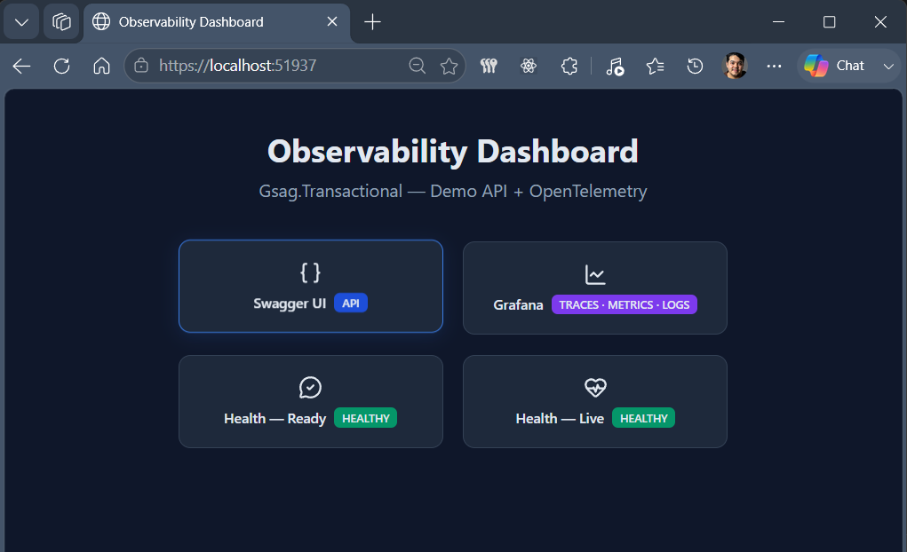
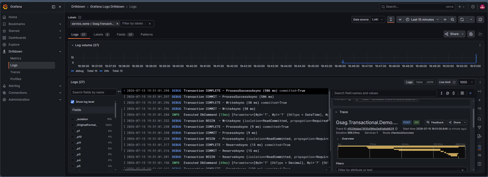
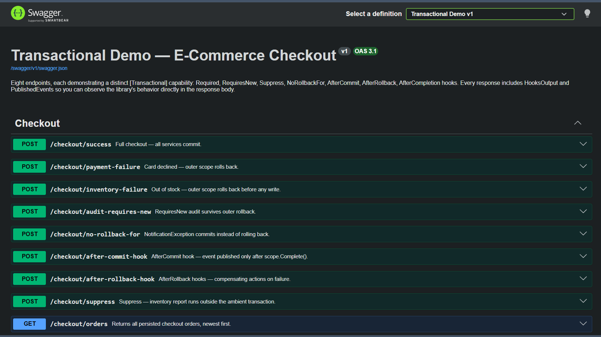

# Demo API — E-Commerce Checkout + Observability

Example ASP.NET Core API demonstrating the `[Transactional]` attribute library through a realistic checkout workflow.

## Preview

<table>
  <tr>
    <td align="center"><strong>Landing Page + Health checks</strong></td>
    <td align="center"><strong>Grafana Traces</strong></td>
    <td align="center"><strong>Swagger UI</strong></td>
  </tr>
  <tr>
    <td><a href="docs/screenshots/landing-page.png"></a></td>
    <td><a href="docs/screenshots/grafana-traces.png"></a></td>
    <td><a href="docs/screenshots/swagger-ui.png"></a></td>
  </tr>
</table>

## Running

**Requirements:** Docker (PostgreSQL and Grafana LGTM containers are managed automatically)

```bash
dotnet run
```

On startup the application:

1. Starts PostgreSQL and Grafana LGTM containers via `docker-compose.yml`
2. Waits for both services to be healthy
3. Opens the **Landing Page** at `https://localhost:51937/`
4. Initializes the database schema

| URL | Description |
|---|---|
| `https://localhost:51937/` | Landing Page — dashboard with links to all services |
| `https://localhost:51937/swagger` | Swagger UI — interactive API documentation |
| `https://localhost:51937/health/ready` | Health check (ready) — PostgreSQL + Grafana status |
| `https://localhost:51937/health/live` | Health check (live) — application liveness |
| `https://localhost:3000` | Grafana — traces, metrics, and logs dashboard |

## What It Demonstrates

### Transactional Endpoints

Eight isolated endpoints, each showcasing a distinct transactional behavior:

| Endpoint | Behavior | What to look for |
|---|---|---|
| `POST /checkout/success` | `Required` propagation | All services join outer scope; AuditService commits independently via `RequiresNew` |
| `POST /checkout/payment-failure` | Rollback on exception | PaymentService throws; outer scope disposed without `Complete()` |
| `POST /checkout/inventory-failure` | Rollback pattern | InventoryService throws; no data persists |
| `POST /checkout/audit-requires-new` | `RequiresNew` scope | Audit entry commits independently; outer scope rolls back but audit survives |
| `POST /checkout/no-rollback-for` | `NoRollbackFor` config | NotificationException commits despite being thrown |
| `POST /checkout/after-commit-hook` | Lifecycle hooks | AfterCommit hook fires only after outer scope commits |
| `POST /checkout/after-rollback-hook` | Compensating hooks | Multiple AfterRollback hooks execute in order after rollback |
| `POST /checkout/suppress` | `Suppress` propagation | InventoryReportService runs outside ambient transaction |

Every POST response includes `hooksOutput` (execution order of hooks) and `publishedEvents` (events after commit) so the transaction lifecycle is observable in the response body.

### Observability Stack

> **Note:** The `Gsag.Transactional.Observability` project is a **sample implementation** demonstrating how to integrate OpenTelemetry with the transactional observer. It is not part of the core library — it is an example you can adapt to your own observability pipeline.

This demo includes a full observability pipeline:

- **Serilog** → structured logging with JSON output
- **OpenTelemetry** → distributed tracing and metrics via OTLP exporter
- **Grafana LGTM** → unified backend for logs (Loki), traces (Tempo), and metrics (Prometheus)

The pipeline is wired with a single call:

```csharp
builder.Services.AddObservabilityPipeline(builder.Configuration);
```

This registers:
- OpenTelemetry tracing and metrics listeners for `gsag.transactional.*` instruments
- Serilog-based log export to OTLP
- Health checks for PostgreSQL and Grafana
- A landing page dashboard at `/`
- HTMX-powered live health badges

### Health Checks

| Endpoint | Tags | Description |
|---|---|---|
| `/health/ready` | `ready` | PostgreSQL + Grafana connectivity |
| `/health/live` | (none) | Application liveness |

Responses are JSON with per-check status, duration, and exception details:

```json
{
  "status": "Healthy",
  "totalDuration": 45.2,
  "checks": [
    {
      "name": "postgresql",
      "status": "Healthy",
      "duration": 12.1,
      "description": "PostgreSQL is reachable.",
      "exception": ""
    },
    {
      "name": "grafana",
      "status": "Healthy",
      "duration": 33.1,
      "description": "Grafana is reachable.",
      "exception": ""
    }
  ]
}
```

## Project Structure

### Demo API

- **Controllers/** — CheckoutController with all scenario and utility endpoints
- **Services/** — OrderService, PaymentService, InventoryService, AuditService, CheckoutService (each demonstrates a transactional pattern)
- **Data/** — CheckoutDbContext with OpenTelemetry-instrumented SaveChanges
- **Entities/** — CheckoutOrder, PaymentRecord, InventoryReservation, AuditEntry
- **Exceptions/** — PaymentDeclinedException, InventoryException, NotificationException
- **Infrastructure/** — EnvironmentBootstrapper (Docker), HookOutputCollector, InMemoryEventBus, InMemoryMetricsObserver

### Observability Sample (`Gsag.Transactional.Observability`)

A sample project demonstrating how to build an observability layer on top of the transactional observer.

- `ObservabilityOptions.cs` — Configuration model (tracing, metrics, logs)
- `OpenTelemetryConventions.cs` — Semantic conventions (metrics, tags, activities)
- `ObservabilityServiceMetadata.cs` — Service name/version resolver
- `Observers/OpenTelemetryTransactionObserver.cs` — `ITransactionObserver` → OTel spans + metrics
- `Extensions/ServiceCollectionExtensions.cs` — `AddObservabilityPipeline()` entry point
- `Extensions/TransactionalBuilderExtensions.cs` — `AddObservability()` builder extension
- `HealthChecks/HealthCheckExtensions.cs` — PostgreSQL + Grafana health checks
- `Startup/ObservabilityStartupFilter.cs` — `IStartupFilter` for landing page + health endpoints
- `Content/LandingPageLoader.cs` — Embedded resource loader
- `Content/landing-page.html` — Dashboard with HTMX live badges

## How to Extend

1. **Add a new entity** in `Entities/`
2. **Add a service** in `Services/` with an interface and `[Transactional]` methods
3. **Register in Program.cs** — the scanner auto-discovers the interface
4. **Add an endpoint** in `Controllers/CheckoutController.cs`
5. **Test** — use existing endpoints as reference patterns

## Key Concepts

- **Required:** Inner service joins outer transaction scope (default)
- **RequiresNew:** Opens independent transaction; outer rollback doesn't affect it
- **Suppress:** Runs without transaction; ambient scope is suspended and resumed
- **NoRollbackFor:** Commits even when specified exception types are thrown
- **Hooks:** BeforeCommit, AfterCommit, BeforeRollback, AfterRollback, AfterCompletion
- **Observers:** Track transaction lifecycle (logging, metrics, tracing)
